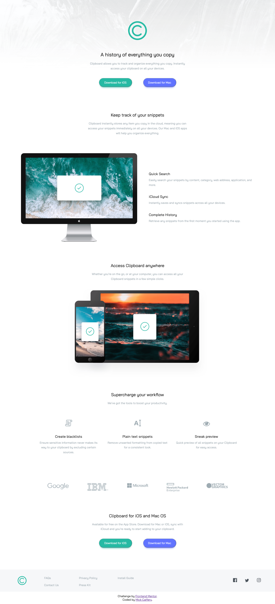
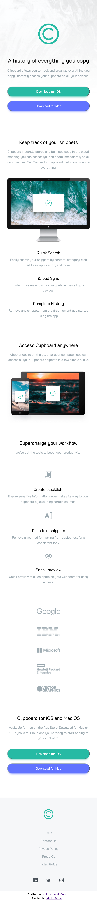

# Frontend Mentor - Clipboard landing page solution

This is a solution to the [Clipboard landing page challenge on Frontend Mentor](https://www.frontendmentor.io/challenges/clipboard-landing-page-5cc9bccd6c4c91111378ecb9). Frontend Mentor challenges help you improve your coding skills by building realistic projects. 

#### Links

- My Solution Live Site URL: [https://nimble-beignet-3178e7.netlify.app/](https://nimble-beignet-3178e7.netlify.app/)

## Table of contents

- [Frontend Mentor - Clipboard landing page solution](#frontend-mentor---clipboard-landing-page-solution)
      - [Links](#links)
  - [Table of contents](#table-of-contents)
  - [Overview](#overview)
    - [The challenge](#the-challenge)
    - [Screenshot](#screenshot)
  - [My process](#my-process)
    - [Built with](#built-with)
    - [What I learned](#what-i-learned)
    - [Continued development](#continued-development)
  - [Author](#author)

## Overview

### The challenge

Users should be able to:

- View the optimal layout for the site depending on their device's screen size
- See hover states for all interactive elements on the page

### Screenshot

Desktop View

Mobile View

## My process

### Built with

- Semantic HTML5 markup
- CSS custom properties
- Flexbox
- Mobile-first workflow

### What I learned

- This challenge helped develop my layout skills for a full-size landing page. It helped me better to understand when to use flexbox.

### Continued development

- I'm currently learning how to use JavaScript to manipulate the DOM. After this, I will learn React. 

## Author

- GitHub - [Mick Caffery](https://github.com/mickcaff)
- Frontend Mentor - [@mickcaff](https://www.frontendmentor.io/profile/mickcaff)
- [LinkedIn](https://www.linkedin.com/in/mcaffery/)

